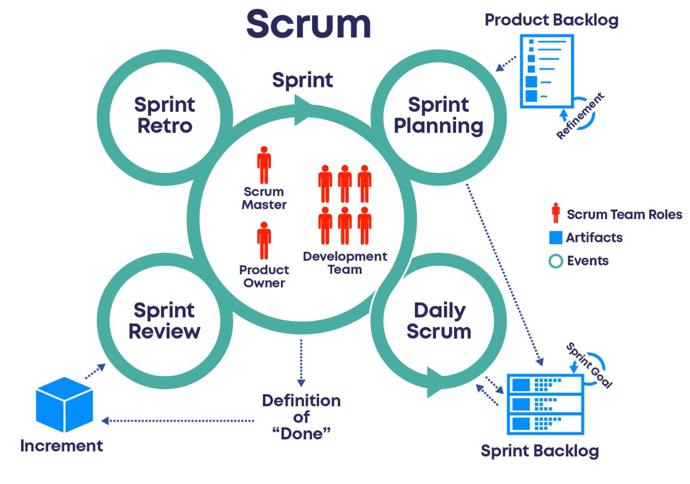

# Scrum Course
### Table of contents
* [Introduction](#introduction) 
* [Illustrations](#illustrations)

## Introduction
In this course we learned that Scrum is a framework that helps teams work together. Scrum encourages teams to learn through experiences, self-organize while working on a problem, and reflect on their wins and losses to continuously improve.

**************************************
## Illustrations

**************************************
